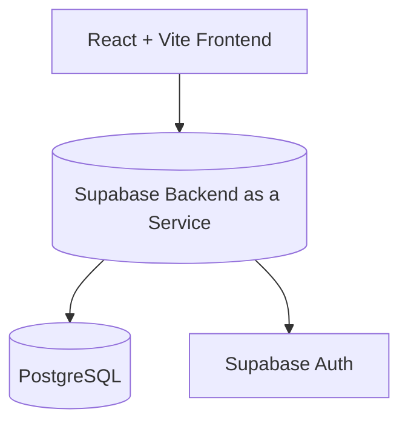

# Architecture Documentation

## Core Architecture

This is a modern React web application built with Vite and Supabase.

## Technologies

- **Frontend:** React, Vite, Tailwind CSS.
- **Backend/DB:** Supabase (PostgreSQL).
- **Runtime:** Node.js / Bun.

---

## 👨‍💻 Credits

**By OutLawZ™** | https://www.brandex.pk | net2tara@gmail.com
